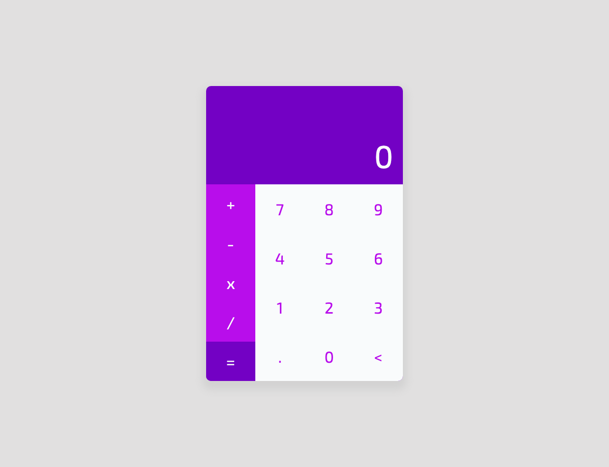

# Calculator

I'm using this project to review basic concepts of HTML, CSS and Vanila JavaScript.

## Screenshot

### Steps

I'm on step #1

1. Build interface
2. Make functional with vanila JavaScript
3. Convert to ReactJS

### Author

Ivan Geier

### Design by

Mateus David - 
